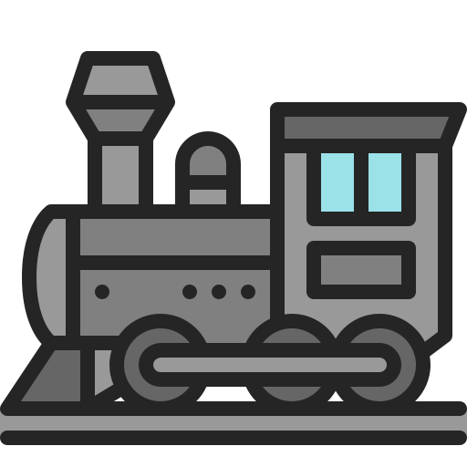
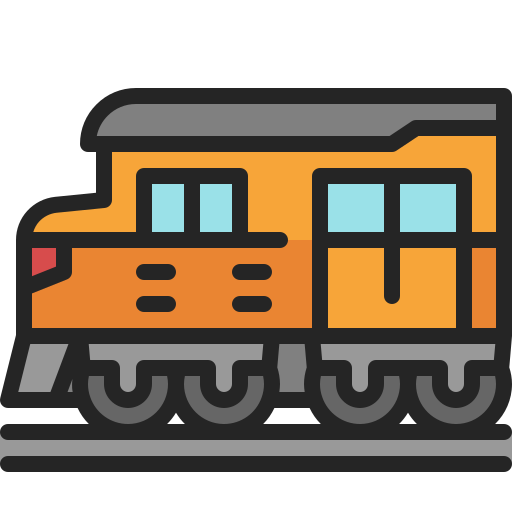
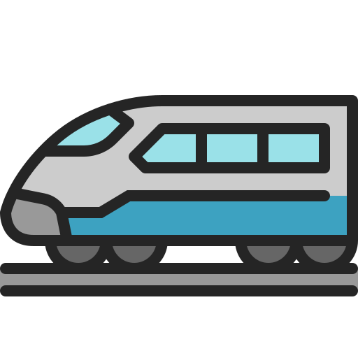
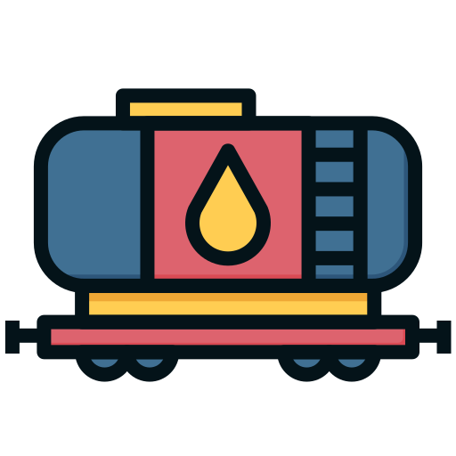
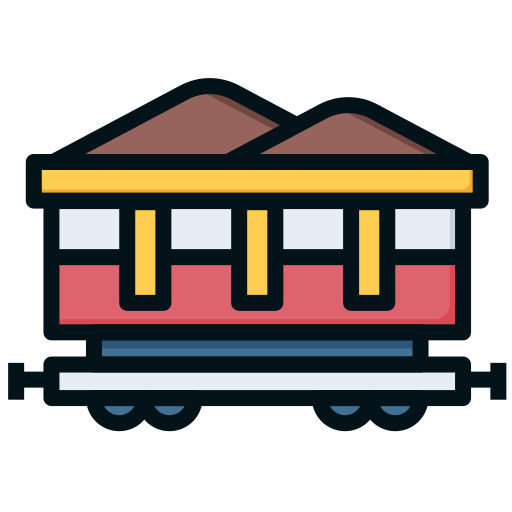
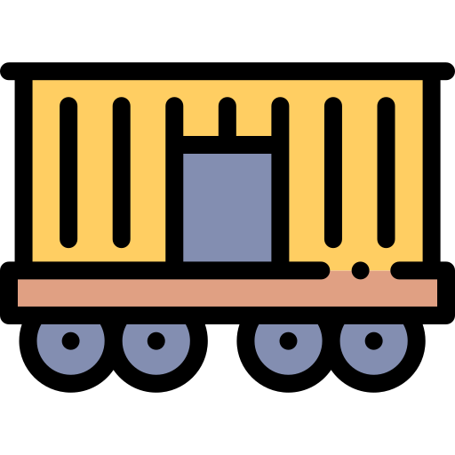
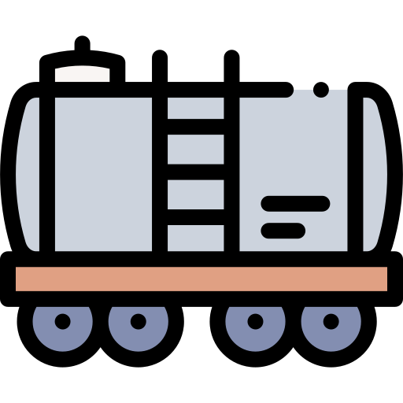
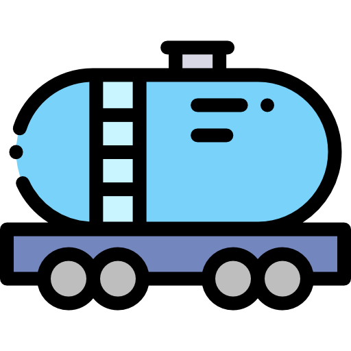
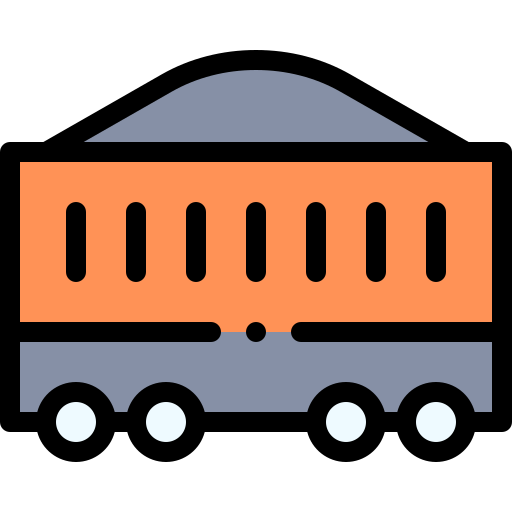

# Credits

## Images

### [Flaticon](https://www.flaticon.com/)
Image|Author|Source
-|-|-
|[Umeicon](https://www.flaticon.com/authors/umeicon)|https://www.flaticon.com/free-icon/steam-locomotive_8397711
|[Umeicon](https://www.flaticon.com/authors/umeicon)|https://www.flaticon.com/free-icon/train_8397740
|[Umeicon](https://www.flaticon.com/authors/umeicon)|https://www.flaticon.com/free-icon/bullet-train_8397459
|[Maswan](https://www.flaticon.com/authors/maswan)|https://www.flaticon.com/free-icon/carriage_4452738
|[Maswan](https://www.flaticon.com/authors/maswan)|https://www.flaticon.com/free-icon/carriage_4452867
|[Maswan](https://www.flaticon.com/authors/maswan)|https://www.flaticon.com/free-icon/carriage_4452743
|[Magnific](https://www.flaticon.com/authors/magnific)|https://www.flaticon.com/free-icon/freight-wagon_2088230
|[Magnific](https://www.flaticon.com/authors/magnific)|https://www.flaticon.com/free-icon/gas-truck_2088199
|[Magnific](https://www.flaticon.com/authors/magnific)|https://www.flaticon.com/free-icon/tank-wagon_756578
|[Magnific](https://www.flaticon.com/authors/magnific)|https://www.flaticon.com/free-icon/wagon_2824772
-|Yliv|https://www.flaticon.com/free-icon/car_12714717

### [Bootstrap Icons](https://icons.getbootstrap.com/) (MIT License)
UI icons (maximize, fullscreen, checkmark) — vendored individually in `vendor/icons/` as they're adopted, inlined via `js/icons.js`.